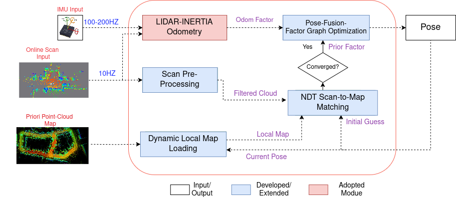

## Robust-LiDAR-Inertial-Re-Localization

## Motivation 
Autonomous robots require accurate localization in GPS-denied environments like
indoors or urban canyons.GNSS-INS systems are prone to failure in these conditions,
while real-time SLAM often drift without loop closures
Map-based localization offers a stable and accurate alternative, but it faces several
key challenges:

1. <srong>Real-time performance and Scalability</strong>: Handling high-resolution 3D maps and
    computing scan-to-map registration efficiently.

2. <strong>Drift correction</strong>: Fusing local motion estimation with global map constraints while
preserving consistency.

3. <strong>Dynamic environments</strong>: Removing or mitigating the effect of moving objects
during scan matching.

4. Localization failures in feature-sparse or unmapped transition zones.

## Contribution
This thesis presents a robust and real-time localization framework for GNSS-denied
environments by fusing LiDAR-Inertial Odometry (FAST-LIO2) with multithreaded
NDT-based map matching using a sliding-window factor graph. It introduces a
scalable submap management strategy and integrates dynamic object removal via
deep learning, enabling consistent pose estimation even in dynamic, degraded, or
feature-sparse areas. The system achieves centimeter- to decimeter-level accuracy
across diverse datasets, maintaining low-latency performance suitable for real-
world autonomous navigation. Extensive evaluations show that the proposed
method not only surpasses standalone odometry and SLAM baselines but also
outperforms recent state-of-the-art map-based localization approaches in accuracy,
robustness, and scalability.

## Methodology 

<div style="display:flex;justify-content:center;">
  <div style="flex:1; margin-right:10px;
              background-color:#fff;   /* <-- make the bg opaque */
              padding:8px;             /* optional border/padding */
              box-shadow:0 0 4px rgba(0,0,0,0.2); /* optional */
              ">
    
    <p style="text-align:center;">Figure 1: Complete Diagram of The Localization System</p>
  </div>
</div>


[paper](./media/Thesis.pdf) | [poster](./media/Poster.pdf) | [Video](https://www.youtube.com/watch?v=dNa92Y9yDuk)

## Conclusions and Future Work

1. <strong>Accurate & Drift-Free</strong>:Achieves sub-decimeter accuracy by fusing FAST-LIO2 and NDT with a sliding-window factor graph, effectively reducing drift without loop closures.
2. <strog>Real-Time & Scalable</strong>: Maintains less than 23 ms latency using multithreaded NDT and dynamic submap loading. Sliding window factor graph optimization remains bounded regardless of trajectory length.
3. <strong>Robust to Challenges</strong>: Dynamic object removal improves convergence, and fused graph keeps localization stable even when scan matching fails.
4. <strong>Limitations & Future Work</strong>: Assumes a known initial pose and a static map. Future directions include global
re-localization, adaptive
## Installation

```

cd ~/ros2_ws/src
git clone git@github.com:eliyaskidnae/Robust-LiDAR-Inertial-Re-Localization.git
cd ~/ros2_ws
colcon build --symlink-install --cmake-args -DCMAKE_BUILD_TYPE=Release

```

follow this documentation to install autoware necessary packages(
https://autowarefoundation.github.io/autoware-documentation/main/installation/autoware/source-installation/)
## Running

```
source /install/setup.bash
ros2 launch fast_lio mapping.launch.py config_file:='ouster64.yaml'
ros2 autoware_ndt_scan_matcher publish_init_pose
ros2 launch autoware_map_loader saxion_loader_super.launch.xml 
ros2 launch autoware_ndt_scan_matcher ndt_scan_matcher_saxion1.launch.xml 
ros2 run map_based_localization fusion_node

```
## 📹 Demo Video

[](https://www.youtube.com/watch?v=dNa92Y9yDuk)

Click the image above or [watch the demo on YouTube](https://www.youtube.com/watch?v=dNa92Y9yDuk).
